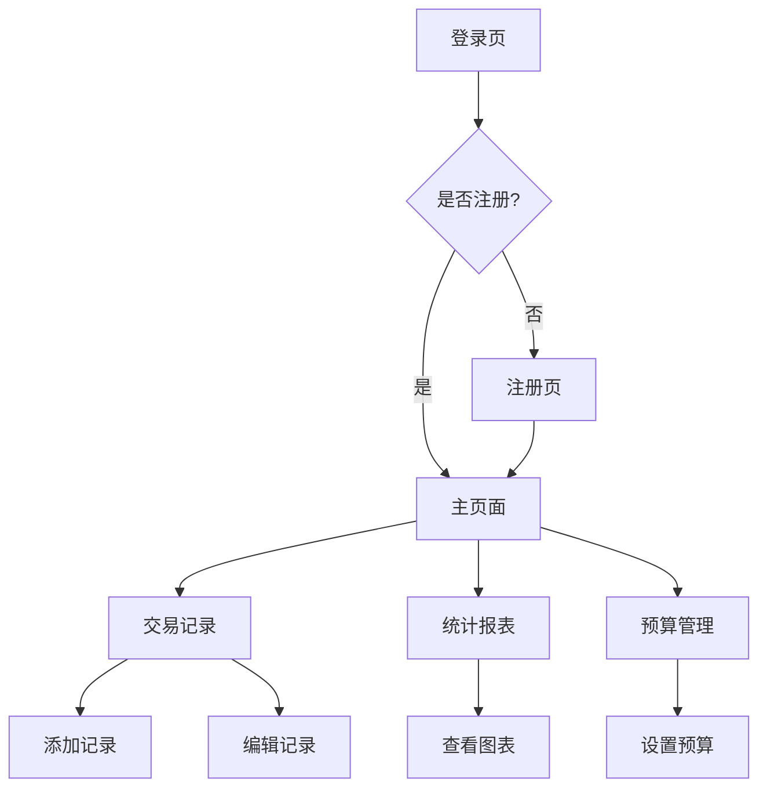

## 1. 产品概述

这是一个基于Vue 3的记账应用前端项目，采用现代工业风格设计。用户可以通过登录注册后使用完整的记账功能，包括收支记录、分类管理、数据统计和预算管理。

产品主要解决个人财务管理的痛点，帮助用户清晰记录和分析收支情况，实现更好的财务规划。

## 2. 核心功能

### 2.1 用户角色

| 角色   | 注册方式    | 核心权限              |
| ---- | ------- | ----------------- |
| 普通用户 | 邮箱注册/登录 | 完整的记账功能、数据统计、预算管理 |
| 访客用户 | 无需注册    | 仅限浏览演示功能          |

### 2.2 功能模块

应用包含以下主要页面：

1. **登录页面**：用户身份验证
2. **注册页面**：新用户注册
3. **主页面**：包含记账、统计、预算等核心功能
4. **交易记录页面**：收支记录的增删改查
5. **统计报表页面**：数据可视化和分析
6. **预算管理页面**：预算设置和监控

### 2.3 页面详情

| 页面名称   | 模块名称 | 功能描述                  |
| ------ | ---- | --------------------- |
| 登录页面   | 身份验证 | 输入邮箱和密码进行登录，支持记住登录状态  |
| 注册页面   | 用户注册 | 填写邮箱、密码完成注册，包含表单验证    |
| 主页面    | 导航栏  | 顶部导航，包含logo、用户信息、退出登录 |
| 主页面    | 快速记账 | 快速添加收入/支出记录，支持语音输入    |
| 主页面    | 今日概览 | 显示今日收支总额、本月预算使用情况     |
| 交易记录页面 | 记录列表 | 按时间倒序显示所有收支记录         |
| 交易记录页面 | 筛选器  | 按日期范围、分类、类型筛选记录       |
| 交易记录页面 | 添加记录 | 表单输入金额、分类、日期、备注       |
| 交易记录页面 | 编辑删除 | 修改或删除已有记录             |
| 统计报表页面 | 收支趋势 | 折线图显示收支变化趋势           |
| 统计报表页面 | 分类占比 | 饼图展示各类别支出占比           |
| 统计报表页面 | 月度对比 | 柱状图对比各月收支情况           |
| 预算管理页面 | 预算设置 | 设置月度/周度预算限额           |
| 预算管理页面 | 预算监控 | 进度条显示预算使用情况           |
| 预算管理页面 | 超支提醒 | 接近或超出预算时发送提醒          |

## 3. 核心流程

用户操作流程：

1. 新用户：访问登录页 → 点击注册 → 填写信息 → 注册成功 → 自动登录 → 进入主页面
2. 老用户：访问登录页 → 输入账号密码 → 登录成功 → 进入主页面
3. 记账流程：主页面 → 点击记账 → 选择收入/支出 → 填写详情 → 保存记录
4. 查看统计：主页面 → 点击统计 → 查看图表分析 → 筛选时间段
5. 预算管理：主页面 → 点击预算 → 设置预算额度 → 查看使用情况

## 4. 用户界面设计

### 4.1 设计风格

* **主色调**：深灰色(#2C3E50)、黑色(#1A1A1A)、银色(#C0C0C0)

* **辅助色**：工业橙色(#FF6B35)用于强调和警告

* **按钮风格**：方形边框，金属质感，hover时有阴影效果

* **字体**：无衬线字体，主标题24px，正文14px

* **布局风格**：卡片式布局，硬朗几何形状，简洁线条

* **图标风格**：线性图标，金属质感，统一线条粗细

### 4.2 页面设计概览

| 页面名称 | 模块名称 | UI元素                      |
| ---- | ---- | ------------------------- |
| 登录页面 | 登录表单 | 居中卡片布局，深灰色背景，银色边框，工业风格输入框 |
| 主页面  | 导航栏  | 顶部固定，黑色背景，银色文字，方形按钮设计     |
| 主页面  | 快速记账 | 圆形悬浮按钮，橙色背景，点击展开表单        |
| 交易记录 | 记录卡片 | 灰色卡片，白色文字，橙色金额显示，边框阴影     |
| 统计报表 | 图表区域 | 深色背景，亮色数据线，网格线使用银色        |
| 预算管理 | 进度条  | 金属质感进度条，橙色填充，百分比显示        |

### 4.3 响应式设计

* **桌面优先**：优先设计桌面端体验，功能完整

* **移动端适配**：768px以下采用移动端布局，底部导航栏

* **触摸优化**：按钮最小44px，支持手势操作

* **断点设置**：1200px(大屏)、992px(中屏)、768px(平板)、576px(手机)

### 4.4 交互动效

* **页面切换**：淡入淡出效果，300ms过渡时间

* **按钮反馈**：点击时有按压效果，颜色变深

* **数据加载**：骨架屏过渡，避免空白等待

* **图表动画**：数据更新时有平滑过渡效果

* **错误提示**：红色

