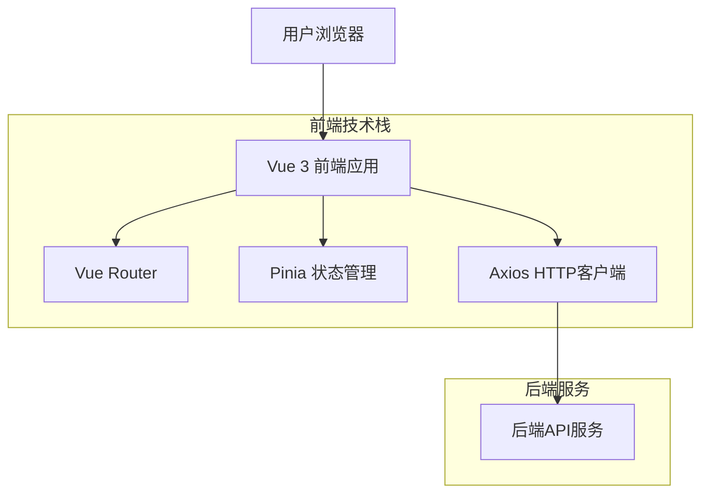

## 1. 架构设计



## 2. 技术描述

- **前端框架**: Vue 3@latest + Composition API
- **构建工具**: Vite@latest
- **初始化工具**: vite-init
- **路由管理**: Vue Router@4
- **状态管理**: Pinia@latest
- **UI组件库**: Element Plus@latest
- **图表库**: ECharts@latest
- **CSS框架**: Tailwind CSS@latest
- **图标库**: @element-plus/icons-vue
- **HTTP客户端**: Axios@latest
- **日期处理**: Dayjs@latest
- **表单验证**: VeeValidate@latest
- **后端**: 已提供API服务

## 3. 路由定义

| 路由路径 | 页面组件 | 功能描述 |
|----------|----------|----------|
| /login | Login.vue | 用户登录页面 |
| /register | Register.vue | 用户注册页面 |
| / | Dashboard.vue | 主页面，包含概览信息 |
| /transactions | Transactions.vue | 交易记录管理页面 |
| /statistics | Statistics.vue | 数据统计报表页面 |
| /budget | Budget.vue | 预算管理页面 |
| /profile | Profile.vue | 用户资料页面 |

## 4. 组件架构

### 4.1 核心组件结构
```
src/
├── components/           # 公共组件
│   ├── Layout/          # 布局组件
│   │   ├── AppHeader.vue
│   │   ├── AppSidebar.vue
│   │   └── AppFooter.vue
│   ├── Common/          # 通用组件
│   │   ├── Loading.vue
│   │   ├── Modal.vue
│   │   └── Chart.vue
│   ├── Transaction/     # 交易相关组件
│   │   ├── TransactionForm.vue
│   │   ├── TransactionList.vue
│   │   └── TransactionCard.vue
│   └── Statistics/      # 统计组件
│       ├── PieChart.vue
│       ├── LineChart.vue
│       └── BarChart.vue
├── views/               # 页面组件
│   ├── Login.vue
│   ├── Register.vue
│   ├── Dashboard.vue
│   ├── Transactions.vue
│   ├── Statistics.vue
│   ├── Budget.vue
│   └── Profile.vue
├── stores/              # 状态管理
│   ├── auth.js          # 用户认证状态
│   ├── transaction.js     # 交易数据状态
│   ├── category.js      # 分类管理状态
│   └── budget.js        # 预算管理状态
├── api/                 # API接口
│   ├── auth.js          # 认证相关接口
│   ├── transaction.js   # 交易相关接口
│   ├── category.js      # 分类相关接口
│   └── budget.js        # 预算相关接口
├── utils/               # 工具函数
│   ├── request.js       # Axios封装
│   ├── format.js        # 格式化函数
│   └── validate.js      # 验证函数
└── assets/              # 静态资源
    ├── styles/          # 样式文件
    └── images/          # 图片资源
```

### 4.2 状态管理设计
```javascript
// stores/auth.js
export const useAuthStore = defineStore('auth', {
  state: () => ({
    user: null,
    token: localStorage.getItem('token'),
    isAuthenticated: false
  }),
  actions: {
    async login(credentials) {
      // 登录逻辑
    },
    async register(userInfo) {
      // 注册逻辑
    },
    logout() {
      // 退出登录
    }
  }
})

// stores/transaction.js
export const useTransactionStore = defineStore('transaction', {
  state: () => ({
    transactions: [],
    categories: [],
    statistics: {}
  }),
  actions: {
    async fetchTransactions(params) {
      // 获取交易记录
    },
    async addTransaction(data) {
      // 添加交易记录
    },
    async updateTransaction(id, data) {
      // 更新交易记录
    },
    async deleteTransaction(id) {
      // 删除交易记录
    }
  }
})
```

## 5. API接口定义

### 5.1 认证相关接口
```
POST /api/auth/login
请求体:
{
  "email": "string",
  "password": "string"
}
响应:
{
  "token": "string",
  "user": {
    "id": "number",
    "email": "string",
    "name": "string"
  }
}

POST /api/auth/register
请求体:
{
  "email": "string",
  "password": "string",
  "name": "string"
}
响应:
{
  "token": "string",
  "user": {
    "id": "number",
    "email": "string",
    "name": "string"
  }
}
```

### 5.2 交易记录接口
```
GET /api/transactions
查询参数:
- page: number
- limit: number
- type: 'income' | 'expense'
- category: string
- startDate: string
- endDate: string
响应:
{
  "data": [{
    "id": "number",
    "amount": "number",
    "type": "string",
    "category": "string",
    "date": "string",
    "description": "string",
    "createdAt": "string"
  }],
  "total": "number",
  "page": "number",
  "limit": "number"
}

POST /api/transactions
请求体:
{
  "amount": "number",
  "type": "string",
  "category": "string",
  "date": "string",
  "description": "string"
}
```

### 5.3 分类管理接口
```
GET /api/categories
响应:
{
  "income": ["工资", "奖金", "投资收益", "其他收入"],
  "expense": ["食品", "交通", "住房", "医疗", "娱乐", "购物"]
}

POST /api/categories
请求体:
{
  "type": "income" | "expense",
  "name": "string"
}
```

### 5.4 预算管理接口
```
GET /api/budget
响应:
{
  "monthlyBudget": "number",
  "weeklyBudget": "number",
  "currentUsage": "number",
  "remaining": "number",
  "percentage": "number"
}

PUT /api/budget
请求体:
{
  "monthlyBudget": "number",
  "weeklyBudget": "number"
}
```

## 6. 样式设计规范

### 6.1 工业风格样式变量
```css
:root {
  /* 主色调 */
  --color-primary: #2C3E50;
  --color-secondary: #1A1A1A;
  --color-accent: #FF6B35;
  --color-silver: #C0C0C0;
  
  /* 背景色 */
  --bg-primary: #1A1A1A;
  --bg-secondary: #2C3E50;
  --bg-card: #34495E;
  
  /* 文字色 */
  --text-primary: #FFFFFF;
  --text-secondary: #C0C0C0;
  --text-accent: #FF6B35;
  
  /* 边框 */
  --border-color: #7F8C8D;
  --border-radius: 4px;
  
  /* 阴影 */
  --shadow-primary: 0 2px 8px rgba(0, 0, 0, 0.3);
  --shadow-hover: 0 4px 16px rgba(0, 0, 0, 0.5);
}
```

### 6.2 组件样式规范
```vue
<!-- 按钮组件样式 -->
<template>
  <button class="btn btn-primary">
    <slot />
  </button>
</template>

<style scoped>
.btn {
  padding: 12px 24px;
  border: 2px solid var(--border-color);
  border-radius: var(--border-radius);
  background: var(--bg-secondary);
  color: var(--text-primary);
  font-weight: 500;
  text-transform: uppercase;
  letter-spacing: 1px;
  transition: all 0.3s ease;
  cursor: pointer;
}

.btn:hover {
  background: var(--color-accent);
  box-shadow: var(--shadow-hover);
  transform: translateY(-2px);
}

.btn-primary {
  background: var(--color-primary);
  border-color: var(--color-silver);
}
</style>
```

## 7. 性能优化

### 7.1 代码分割
- 路由懒加载
- 组件按需加载
- 第三方库CDN引入

### 7.2 缓存策略
- API响应缓存
- 组件状态持久化
- 图片资源懒加载

### 7.3 监控指标
- 首屏加载时间 < 2s
- 交互响应时间 < 100ms
- 内存占用 < 100MB